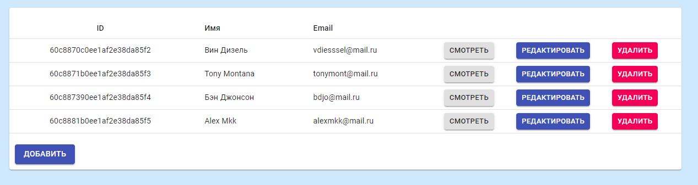
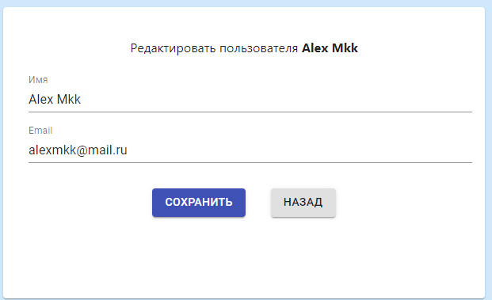
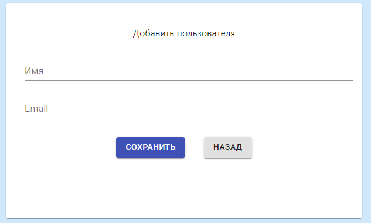

# Описание
Простое CRUD-приложение, которое состоит из GraphQL сервера и клиентского приложения, которое представляет список пользователей с возможностью редактирования.
Для хранения данных используется локальная база MongoDB.
Приложение демонстрирует работу GraphQL и начальную настройку сервера для обрабоки запросов.

# Внешний вид приложения
* Общий список пользователей.

* Редактирование информации о пользователе

* Добавление нового пользователя 

